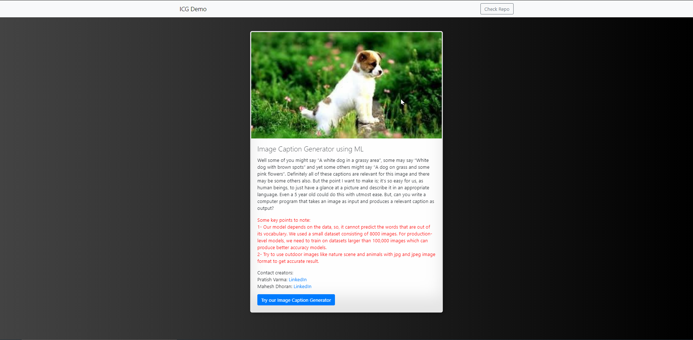

# **Image-Caption-Generator**

**Table of Contents :**

- Introduction
- Motivation
- Prerequisites
- Data collection
- Model Architecture
- Conclusion and Future work
- Result
- Creators
- Reference

**1. Introduction :**

What do you see in the below picture?

Can you write a caption?

Well some of you might say &quot; **A white dog in a grassy area**&quot;, some may say &quot; **White dog with brown spots**&quot; and yet some others might say &quot; **A dog on grass and some pink flowers**&quot;.

Definitely all of these captions are relevant for this image and there may be some others also. But the point I want to make is; it&#39;s so easy for us, as human beings, to just have a glance at a picture and describe it in an appropriate language. Even a 5 year old could do this with utmost ease.

But, can you write a computer program that takes an image as input and produces a relevant caption as output?

Just prior to the recent development of Deep Neural Networks this problem was inconceivable even by the most advanced researchers in Computer Vision. But with the advent of Deep Learning this problem can be solved very easily if we have the required dataset.

**2. Motivation :**

We must first understand how important this problem is to real world scenarios. Let&#39;s see few applications where a solution to this problem can be very useful.

- Self driving cars — Automatic driving is one of the biggest challenges and if we can properly caption the scene around the car, it can give a boost to the self driving system.
- Aid to the blind — We can create a product for the blind which will guide them travelling on the roads without the support of anyone else. We can do this by first converting the scene into text and then the text to voice. Both are now famous applications of Deep Learning. Refer this link where its shown how Nvidia research is trying to create such a product.
- CCTV cameras are everywhere today, but along with viewing the world, if we can also generate relevant captions, then we can raise alarms as soon as there is some malicious activity going on somewhere. This could probably help reduce some crime and/or accidents.
- Automatic Captioning can help, make Google Image Search as good as Google Search, as then every image could be first converted into a caption and then search can be performed based on the caption.

**3. Prerequisites :**

This post assumes familiarity with basic Deep Learning concepts like Multi-layered Perceptrons, Convolution Neural Networks, Recurrent Neural Networks, Transfer Learning, Gradient Descent, Backpropagation, Overfitting, Probability, Text Processing, Python syntax and data structures, Keras library, etc.

Front end :-knowledge of HTML CSS JS Booststrap

Backend :- Python programing and Flask.

**4. Data Collection :**

For the image caption generator, we will be using the Flickr\_8K dataset. There are also other big datasets like Flickr\_30K and MSCOCO dataset but it can take weeks just to train the network so we will be using a small Flickr8k dataset. The advantage of a huge dataset is that we can build better models.

- [Flicker\_8k\_Dataset](https://github.com/jbrownlee/Datasets/releases/download/Flickr8k/Flickr8k_Dataset.zip)
- [Flicker\_8k\_text](https://github.com/jbrownlee/Datasets/releases/download/Flickr8k/Flickr8k_text.zip)

training a model with large number of images may not be feasible on a system which is not a very high end PC/Laptop.

This dataset contains 8000 images each with 5 captions.

**5. Model Architecture :**

**What is CNN?**

Convolutional Neural networks are specialized deep neural networks which can process the data that has input shape like a 2D matrix. Images are easily represented as a 2D matrix and CNN is very useful in working with images.

It scans images from left to right and top to bottom to pull out important features from the image and combines the feature to classify images. It can handle the images that have been translated, rotated, scaled and changes in perspective.

**What is LSTM?**

LSTM stands for Long short term memory, they are a type of RNN (recurrent neural network) which is well suited for sequence prediction problems. Based on the previous text, we can predict what the next word will be. It has proven itself effective from the traditional RNN by overcoming the limitations of RNN which had short term memory. LSTM can carry out relevant information throughout the processing of inputs and with a forget gate, it discards non-relevant information.

**Image Caption Generator Model**

So, to make our image caption generator model, we will be merging these architectures. It is also called a CNN-RNN model.

- CNN is used for extracting features from the image. We will use the pre-trained model Xception.
- LSTM will use the information from CNN to help generate a description of the image.

To define the structure of the model, we will be using the Keras Model from Functional API. It will consist of three major parts:

- Feature Extractor – The feature extracted from the image has a size of 2048, with a dense layer, we will reduce the dimensions to 256 nodes.
- Sequence Processor – An embedding layer will handle the textual input, followed by the LSTM layer.
- Decoder – By merging the output from the above two layers, we will process by the dense layer to make the final prediction. The final layer will contain the number of nodes equal to our vocabulary size.

**6. Conclusion and Future work :**

Note that due to the stochastic nature of the models, the captions generated by you (if you try to replicate the code) may not be exactly similar to those generated in my case.

Of course this is just a first-cut solution and a lot of modifications can be made to improve this solution like:

- Using a larger dataset.
- Changing the model architecture, e.g. include an attention module.
- Doing more hyper parameter tuning (learning rate, batch size, number of layers, number of units, dropout rate, batch normalization etc.).
- Use the cross validation set to understand overfitting.
- Using Beam Search instead of Greedy Search during Inference.
- Using BLEU Score to evaluate and measure the performance of the model.

**Important Point:**

We must understand that the images used for testing must be semantically related to those used for training the model. For example, if we train our model on the images of cats, dogs, etc. we must not test it on images of air planes, waterfalls, etc. This is an example where the distribution of the train and test sets will be very different and in such cases no Machine Learning model in the world will give good performance.

**7. Result :**

### 8. Creators :

 [Mahesh Dhoran](https://www.linkedin.com/in/maheshdhoran/)
 
 [Pratish Varma](https://www.linkedin.com/in/pratish-varma-a72306197/)
### 9. Reference :
[harshall lamba](https://towardsdatascience.com/@harshall.lamba)
